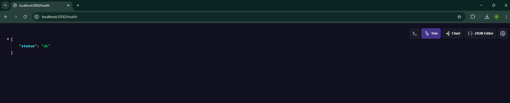
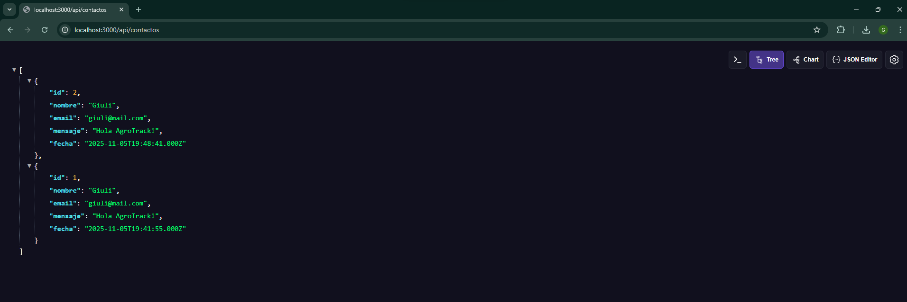

# 🌾 AgroTrack AO2 – API con Express y MySQL

### 🧠 Materia:
**Programación de Aplicaciones Web II**  
### 👩‍💻 Autora:
**Giuliana Mandrini Gatti**

---

## 📋 Descripción
Esta segunda versión del proyecto **AgroTrack** implementa una **API REST** desarrollada con **Node.js**, **Express** y **MySQL**, cumpliendo con los requerimientos de la Actividad Obligatoria 2.  
El objetivo es exponer una API de contactos que permita recibir y listar consultas almacenadas en una base de datos MySQL.

---

## ⚙️ Tecnologías utilizadas
- Node.js  
- Express.js  
- MySQL (con `mysql2/promise`)  
- Dotenv  
- Nodemon (para desarrollo)

---

## 🗂️ Estructura del proyecto

```
agrotrackAO2/
│
├─ app.js                 # Servidor principal Express
├─ db.js                  # Conexión a MySQL
├─ routes/contactos.js    # Endpoints /api/contactos
├─ middleware/
│   ├─ logger.js          # Middleware de registro de solicitudes
│   └─ errorHandler.js    # Manejo centralizado de errores
├─ public/                # Archivos estáticos (index, estilos, favicon, etc.)
├─ sql/schema.sql         # Script para crear la BD y tabla
├─ .env.example           # Variables de entorno de ejemplo
├─ README.md
└─ AgroTrack-AO2.postman_collection.json
```

---

## 🧩 Variables de entorno
Crea un archivo **.env** en la raíz del proyecto basado en el `.env.example`:

```bash
PORT=3000
DB_HOST=127.0.0.1
DB_PORT=3006   # <— Puerto REAL de tu MySQL
DB_USER=root
DB_PASSWORD=
DB_NAME=agrotrack
```

> ⚠️ **No subas tu archivo `.env` al repositorio.**  
> Solo se debe versionar `.env.example` y reflejar también aquí `DB_PORT=3006`.

---

## 💾 Base de datos
Ejecutar el siguiente script para crear la base y la tabla necesarias:

**Archivo:** `sql/schema.sql`
```sql
CREATE DATABASE IF NOT EXISTS agrotrack;
USE agrotrack;

CREATE TABLE IF NOT EXISTS contactos (
  id INT AUTO_INCREMENT PRIMARY KEY,
  nombre  VARCHAR(100) NOT NULL,
  email   VARCHAR(150) NOT NULL,
  mensaje TEXT NOT NULL,
  fecha   TIMESTAMP DEFAULT CURRENT_TIMESTAMP
);
```

---

## 🚀 Instalación y ejecución

```bash
# Instalar dependencias
npm install

# Ejecutar en modo desarrollo
npm run dev

# O modo producción
npm start
```

El servidor se iniciará en:  
👉 **http://localhost:3000**

---

## 📡 Endpoints disponibles

| Método | Ruta | Descripción |
|---------|------|-------------|
| GET | `/health` | Verifica el estado del servidor |
| GET | `/api/contactos` | Devuelve todas las consultas registradas |
| POST | `/api/contactos` | Registra una nueva consulta (nombre, email, mensaje) |

---

## 📬 Ejemplo de uso (POST /api/contactos)

**Request:**
```json
{
  "nombre": "Giuli",
  "email": "giuli@mail.com",
  "mensaje": "Hola AgroTrack!"
}
```

**Response (201 Created):**
```json
{
  "id": 1,
  "nombre": "Giuli",
  "email": "giuli@mail.com",
  "mensaje": "Hola AgroTrack!"
}
```

**Error (400):**
```json
{ "error": "nombre, email y mensaje son obligatorios" }
```

---

## 🧪 Uso con Postman

### 📦 Importar la colección
1. Abrí **Postman** (versión de escritorio o Web + Desktop Agent).  
2. Hacé clic en **Import → Raw text**.  
3. Pegá el contenido del archivo `AgroTrack-AO2.postman_collection.json`.  
4. Confirmá con **Import**.

### 🔗 Configurar variable baseUrl
En la pestaña *Variables* de la colección:
```
baseUrl = http://localhost:3000
```

### 🧭 Requests incluidos
| Nombre | Método | Descripción |
|--------|--------|-------------|
| **GET /health** | Verifica el estado del servidor |
| **GET /api/contactos** | Devuelve todos los registros |
| **POST /api/contactos (válido)** | Inserta un contacto correcto |
| **POST /api/contactos (inválido)** | Prueba las validaciones del servidor |

> Todos los endpoints devuelven respuestas en formato JSON.

---

## 📸 Resultados de prueba

### ✅ Health Check  


### 📤 Inserción de contacto (POST)  


> Las imágenes se encuentran dentro de la carpeta `imagenes/` del proyecto y muestran las respuestas correctas de los endpoints `/health` y `/api/contactos` en Postman.

---

## 🧾 Checklist de entrega

- [x] Servidor Express funcional  
- [x] Middleware de logger y error handler  
- [x] Variables de entorno con `.env` y `.env.example` (DB_PORT=3006)  
- [x] Conexión MySQL funcionando  
- [x] Rutas `/health` y `/api/contactos` (GET/POST)  
- [x] Validaciones y manejo de errores  
- [x] Documentación en README  
- [x] Colección Postman incluida  
- [x] Formulario de contacto funcional (fetch + redirección)  
- [x] Login con credenciales predefinidas

---

## 🔐 Login de demostración

El sistema incluye una página de **login básico** (demo) accesible desde:

```
http://localhost:3000/login.html
```

### 📋 Descripción
El login no valida contra una base de datos: es solo una **prueba funcional** para evaluar el flujo de envío y respuesta con `fetch()`.  
Las credenciales válidas se definen manualmente en el archivo **`app.js`**, dentro de la ruta:

```js
app.post('/login', (req, res) => {
  const { usuario, clave } = req.body;
  if (!usuario || !clave) {
    return res.status(400).send('Faltan credenciales');
  }

  // 💡 Usuario y contraseña definidos en el backend
  const usuarioValido = 'giuli';
  const claveValida = '1234';

  if (usuario.toLowerCase() === usuarioValido && clave === claveValida) {
    return res.status(200).send('Bienvenida, Giuli 👋');
  } else {
    return res.status(401).send('Usuario o clave incorrectos');
  }
});
```

---

### 🧠 Cómo usarlo

1. Ingresar a `http://localhost:3000/login.html`  
2. Escribir las credenciales predefinidas:

| Usuario | Contraseña |
|----------|-------------|
| `giuli`  | `1234` |

3. Presionar **Enviar**.  
   - Si los datos son correctos, aparecerá un mensaje de éxito ✅ y el sistema redirigirá automáticamente a `/contacto.html`.  
   - Si son incorrectos, se mostrará un mensaje de error ⚠️ sin recargar la página.

---

### ⚙️ Personalizar tus propias credenciales

Podés modificar libremente el usuario y contraseña desde `app.js`:

```js
const usuarioValido = 'admin';
const claveValida = 'admin123';
```

Luego guardá y reiniciá el servidor con:

```bash
npm run dev
```

---

### 💬 Notas
- El login usa `fetch()` para enviar los datos en formato JSON.  
- No guarda sesiones ni utiliza base de datos (es solo demostrativo).  
- Todo el comportamiento se maneja desde el frontend (`login.html`) y el backend (`app.js`).

---

## 🕓 Historial de versiones

| Versión | Descripción |
|----------|-------------|
| **AO1** | Servidor HTTP nativo con persistencia en archivo `.txt` |
| **AO2** | Migración a Express, MySQL, formularios dinámicos y login con fetch |
